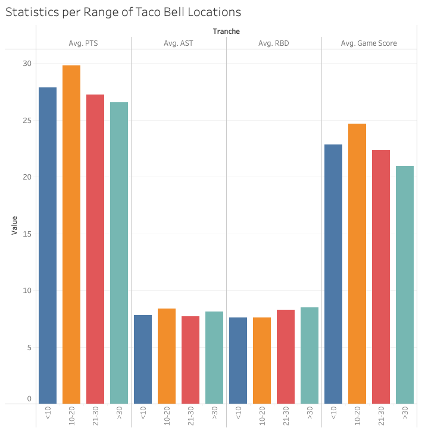

# Taco-Tuesday

##### Author: Nicolas H

##### Date: March 13, 2023

##### Disclaimer : This project is only to be taken as a mean of showcasing some Tableau skills through the representation and analysis of LeBron James's relationship with Tacos. The analysis is not to be taken too seriously as it integrates low sample size for some of the data and willingly ignore a lot of factors that could explain the variations in LeBron's performances. 

##### [Tableau Dashboard Link](https://public.tableau.com/shared/JTTC2KJCP?:display_count=n&:origin=viz_share_link)

          

## Scenario
During Summer 2019 NBA superstar LeBron James posted an Instagram story of him and his family enjoying tacos and following the Mexican tradition of eating tacos on tuesdays. The video went viral and for the entire summer every tuesday a new video of him would be posted, thus creating a new tradition for LeBron and his family. The purpose of this project is to analyse the relationship of LeBron and tacos and how it translates to his performances in NBA games.

#### The viral video 

https://www.youtube.com/watch?v=UFOHYRZAu3I

## Data Preparation

To conduct this analysis I needed two different dataset : all in game statistics from LeBron since the start of his Taco Tuesday tradition and the number of Taco Bells in NBA cities, the leading Taco restaurant chain in the US.

To gather all the data from LeBron's games from 2019 to 2023 I used the website https://www.basketball-reference.com/ which is renown for its quality. I pulled all his stats for the 4 NBA seasons since 2019 and merged all the data by using SQL queries.

For the taco bell locations I used the official website https://locations.tacobell.com/index.html and pulled the data for all 30 NBA cities. I then cleaned it and prepared it for Tableau by adding a few necessary columns.

## Analysis

-  [2019-2023 Performance](#2019-2023-performance)
-  [Performance on Tuesdays](#performance-on-tuesdays)
-  [LeBron and Taco Restaurants](#lebron-and-taco-restaurants)
-  [Final Thoughts](#final-thoughts)

### 2019-2023 Performance

To better vizualize what a "normal" LeBron performance looked like I created a Tableau dashboard presenting some data about his statistics since 2019. I used Figma to create the background layout.

Here it is again : 

On the 4 top boxes are presented his game average in all 3 main stats : Points, Assists and Rebound. For the sake of clarity I did not include more advanced stat like field goal percentage and chose to instead include the game score stat, which is a compounded score wich takes into account statistics such as steal and blocks.

The dashboard is interactive so you can filter it by year. I also included a summary of his top scoring performances against each of the other 29 NBA teams. 

### Performance on Tuesdays

With the first graph I wanted to outline the difference in LeBron's performance on tuesdays. As we can see there is a small but noticable improvement in both his scoring abilities and his game score. However a really interesting thing happen when we filter by year.

The above graph is filtered for the year 2019. We can notice a huge decrease in performance on tuesdays.

This one if filtered for the year 2020 and 2021, we can see that on these two years on the contrary the production of LeBron is way higher on tuesdays.
For 2022 and 2023 the data evens out between tuesdays and the rest of the week.

#### Hypothesis : Maybe this could be explained by the fact that on the first year of his new Taco Tuesday tradition LeBron was too eager to go back home on tuesdays and had his head too full of taco thoughts to perform as he should. ¯\_(ツ)_/¯ 

#### Management must have taken a notice and filed a complaint forbidding him to celebrate taco tuesday on the following year unless he produced way better in-game performances which would explain his amazing stats on tuesdays for the year 2020 and 2021, LeBron would have then been fueled by his love of taco.

#### Then the taco tuesday gets forgotten with time wich explains the normalization of his stats between tuesday and other days of the week.

### LeBron and Taco Restaurants

Here is a custom made map vizualization of Taco Bells, the reference of taco restaurant, in all cities doted of an NBA team. On the map the bigger the taco means the more Taco Bells the city contains. You can pass your move on each of the tacos icon to get the exact number per city.

This graph is made to show how the number of taco bells in an NBA city translates to Lebron's performance in said city.

I divided the NBA cities in four categories to see things under a better light : cities with fewer than 10 Taco Bells, between 10 and 20, between 21 and 30 and finally more than 30.

As we can see he performs best when there isn't too many taco bells, with a peak for cities doted of between 10 and 20 Taco Bells location.

This graph is a scatter plot of LeBron's game score stat crossed with the number of taco bells in city he plays in. This corroborate the first graph and the trend line indeed shows a decrease in performance when there is too many Tacos options around LeBron !

### Final Thoughts

Thanks for reading this little project of mine. I familiarized myself with a lot of Tableau features along the way and I hope this can serve as a little showcase of it.
